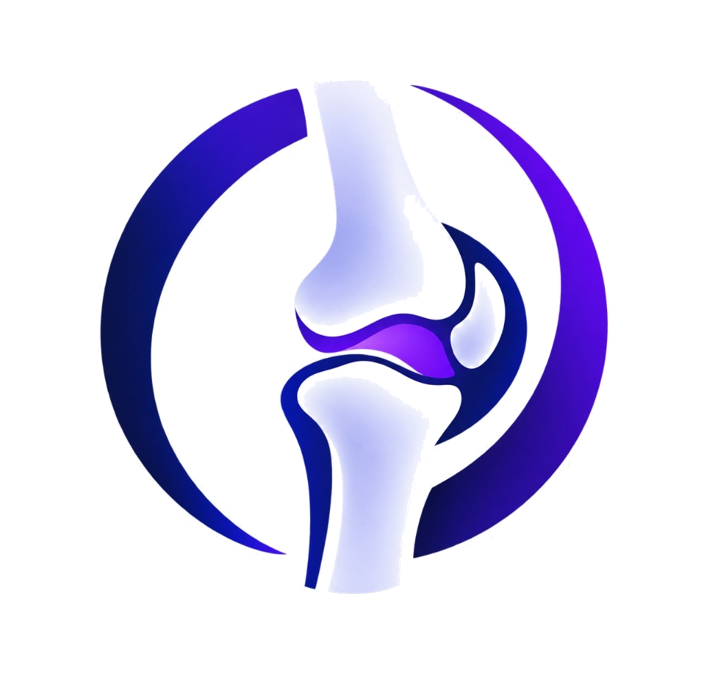

<div align="center">



# ORTHINX

### AI-Assisted Knee Assessment & Patient-Specific Implant Planning

[](https://python.org)
[](https://fastapi.tiangolo.com)
[](https://react.dev)
[](https://typescriptlang.org)
[](https://pytorch.org)
[](https://monai.io)
[](LICENSE)

**A full-stack clinical decision support system combining deep learning segmentation, anatomical morphometry, and intelligent implant matching for orthopedic knee surgery planning.**

---

[Features](#-features) · [Architecture](#-architecture) · [Getting Started](#-getting-started) · [API Reference](#-api-reference) · [Screenshots](#-screenshots) · [Testing](#-testing) · [License](#-license)

</div>

---

## ✨ Features

### 🧠 AI Segmentation Engine
- **MONAI 2D U-Net** with Batch Normalization (`channels=[16, 32, 64, 128, 256]`, `num_res_units=2`)
- Binary knee joint segmentation (Class 0: Background, Class 1: Knee Joint)
- Validated production model: `best_model_v2.pth` (18.77 MB)
- GPU-accelerated inference (CUDA) with CPU fallback — typical inference in **< 70ms**

### 📐 Anatomical Measurements
- **Joint Space Width (JSW)** profiling across vertical cross-sections
- Native-space geometric feature extraction (bounding box, centroid, connected components)
- **Calibration-safe** reporting: pixel-only metrics when physical spacing is absent; millimeter conversion only when verified pixel spacing is explicitly provided
- Quality control classification: `VALID`, `VALID_WITH_WARNING`, `INVALID`

### 🖼️ Single-Image Analysis Pipeline
- **Upload → Enhance → Analyze** workflow for any knee radiograph
- Supports PNG, JPEG, TIFF, BMP, and DICOM formats at any resolution or aspect ratio
- Configurable adaptive enhancement: Percentile Contrast Normalization, CLAHE, Boundary-Preserving Denoising
- Aspect-ratio-preserving letterbox preprocessing (`scale = min(512/w, 512/h)`) with symmetric zero-padding
- Exact native-space mask restoration without geometric distortion

### 🩻 Medical Image Preprocessing
- **NIfTI** (`.nii`, `.nii.gz`), **DICOM** (`.dcm`), and **2D radiograph** support
- Intensity normalization: Min-Max, Z-Score, Percentile Clipping
- Physical voxel spacing spline resampling
- Canonical RAS+ anatomical orientation standardization

### 🦴 Implant Planning & Matching
- Femoral condylar width, AP diameter, and tibial plateau measurements
- Automated implant size recommendation with anatomical fit percentages
- OA severity grading and surgical planning support

### 🖥️ Premium Clinical Frontend
- **True Black medical dark mode** — minimal, premium, clinical aesthetic
- 13 interactive pages with micro-animations and glassmorphism effects
- Real-time interactive trend charts and 3D knee visualization
- Patient records management with async backend synchronization
- Dynamic diagnostic reports with selectable pagination (4, 8, 12, 20, All rows)
- Drag-and-drop single image upload with live enhancement preview and overlay visualizer

---

## 🏛️ Architecture

```
ORTHINX/
│
├── src/                          # React + TypeScript Frontend
│   ├── assets/                   # Logo, medical images, segmentation overlays
│   ├── components/
│   │   ├── layout/               # Sidebar, TopBar, MainLayout
│   │   └── ui/                   # AnimatedButton, InteractiveTrendChart, ThreeKneeVisualizer
│   ├── lib/
│   │   └── api.ts                # Typed API client (patientApi, scanApi)
│   ├── pages/
│   │   ├── DashboardPage.tsx     # Clinical dashboard with KPIs and trend charts
│   │   ├── PatientRecordsPage.tsx# Patient CRUD with backend sync
│   │   ├── UploadImagePage.tsx   # Single-image upload, enhancement, and AI analysis
│   │   ├── MeniscusAnalysisPage.tsx
│   │   ├── AnatomicalMeasurementsPage.tsx
│   │   ├── ImplantRecommendationPage.tsx
│   │   ├── ReportsPage.tsx       # 24 unique patient reports with dynamic pagination
│   │   ├── LoginPage.tsx         # Authentication with animated transitions
│   │   └── ...                   # Settings, Help, AI Processing, Analysis Results
│   ├── store/                    # Zustand state management (auth, patients, theme)
│   └── router.tsx                # React Router v7 route configuration
│
├── knee ai analyzer/
│   └── knee ai analyzer/         # Python FastAPI Backend
│       ├── app/
│       │   ├── api/              # REST endpoints (patients, scans, images)
│       │   ├── core/             # Configuration, constants, path management
│       │   ├── db/               # SQLAlchemy engine and sessions
│       │   ├── models/           # ORM models (Patient, Scan)
│       │   ├── schemas/          # Pydantic validation schemas
│       │   └── services/
│       │       ├── preprocessing/ # Image loading, validation, normalization
│       │       ├── segmentation/  # U-Net model loading and inference
│       │       ├── measurements/  # JSW profiling, geometry, quality control
│       │       ├── single_image/  # Single-image analysis pipeline
│       │       ├── assessment/    # OA grading and clinical assessment
│       │       ├── reporting/     # PDF/JSON report generation
│       │       └── training/      # Model training utilities (dataset, transforms)
│       ├── model_weights/        # Validated V2 U-Net weights (best_model_v2.pth)
│       ├── data/                 # Uploads, processed images, results, validation
│       ├── tests/                # Pytest test suite (12+ test modules)
│       ├── requirements.txt      # Python dependencies
│       └── README.md             # Backend-specific documentation
│
├── index.html                    # Application entry point
├── vite.config.ts                # Vite + proxy configuration
├── tsconfig.json                 # TypeScript configuration
├── package.json                  # Node.js dependencies and scripts
└── .gitignore                    # Git exclusion rules
```

---

## 🚀 Getting Started

### Prerequisites

| Tool | Version | Purpose |
|------|---------|---------|
| **Node.js** | 18+ | Frontend build and dev server |
| **Python** | 3.10+ | Backend API and AI inference |
| **Git** | 2.30+ | Version control |

### 1. Clone the Repository

```bash
git clone https://github.com/smsrinivasmanikandan-sudo/ORTHINX.git
cd ORTHINX
```

### 2. Install Frontend Dependencies

```bash
npm install
```

### 3. Install Backend Dependencies

```bash
cd "knee ai analyzer/knee ai analyzer"
python -m venv venv

# Windows PowerShell
.\venv\Scripts\Activate.ps1

# Linux / macOS
source venv/bin/activate

pip install -r requirements.txt
cd ../..
```

### 4. Configure Environment

```bash
cd "knee ai analyzer/knee ai analyzer"
cp .env.example .env
# Edit .env with your settings (database URL, secret key, etc.)
cd ../..
```

### 5. Start the Application

**Terminal 1 — Backend API Server:**
```bash
npm run backend
# or manually:
cd "knee ai analyzer/knee ai analyzer"
python -m uvicorn app.main:app --host 127.0.0.1 --port 8000 --reload
```

**Terminal 2 — Frontend Dev Server:**
```bash
npm run dev
```

### 6. Open in Browser

| Service | URL |
|---------|-----|
| **Frontend** | [http://localhost:5173](http://localhost:5173) |
| **Backend API** | [http://127.0.0.1:8000](http://127.0.0.1:8000) |
| **Swagger Docs** | [http://127.0.0.1:8000/docs](http://127.0.0.1:8000/docs) |
| **Health Check** | [http://127.0.0.1:8000/health](http://127.0.0.1:8000/health) |

---

## 📡 API Reference

### Patients

| Method | Endpoint | Description |
|--------|----------|-------------|
| `GET` | `/patients` | List all patients |
| `POST` | `/patients` | Create a new patient |
| `GET` | `/patients/{id}` | Get patient details |
| `PUT` | `/patients/{id}` | Update patient info |
| `DELETE` | `/patients/{id}` | Delete a patient |

### Scans & Analysis

| Method | Endpoint | Description |
|--------|----------|-------------|
| `POST` | `/patients/{id}/images` | Upload a medical image |
| `GET` | `/scans/{id}/metadata` | Extract scan metadata |
| `POST` | `/scans/{id}/preprocess` | Preprocess with configurable normalization |
| `POST` | `/scans/{id}/segment` | Run V2 U-Net segmentation |
| `POST` | `/scans/{id}/measurements` | Extract JSW and anatomical measurements |
| `POST` | `/scans/{id}/report` | Generate clinical report (PDF/JSON) |

### Single-Image Pipeline

| Method | Endpoint | Description |
|--------|----------|-------------|
| `POST` | `/scans/analyze-single` | Full pipeline: Upload → Enhance → Segment → Measure → QC |
| `POST` | `/scans/enhance-preview` | Preview enhancement (original vs enhanced side-by-side) |

---

## 🖥️ Frontend Pages

| Page | Route | Description |
|------|-------|-------------|
| Dashboard | `/` | Clinical KPIs, trend charts, segmentation showcase |
| Patient Records | `/patients` | Full CRUD with search, pagination, backend sync |
| Knee Analysis | `/upload` | Single-image upload, enhancement controls, AI analysis |
| Meniscus Analysis | `/analysis/meniscus` | Meniscus thickness mapping and zone analysis |
| Anatomical Measurements | `/analysis/measurements` | Femoral/tibial dimension inspection |
| Implant Planning | `/implant-planning` | Automated implant size recommendation |
| Reports | `/reports` | 24 unique diagnostic reports with dynamic pagination |
| Settings | `/settings` | PACS integration, model config, theme toggle |
| Help & Support | `/help` | FAQ and clinical documentation |

---

## 🤖 Model Details

| Property | Value |
|----------|-------|
| **Architecture** | MONAI 2D U-Net |
| **Input** | `1 × 1 × 512 × 512` (grayscale, float32, [0, 1]) |
| **Output** | `1 × 2 × 512 × 512` (2-class softmax) |
| **Channels** | `[16, 32, 64, 128, 256]` |
| **Residual Units** | 2 per level |
| **Normalization** | Batch Normalization |
| **Classes** | 0 = Background, 1 = Knee Joint |
| **Weight File** | `model_weights/best_model_v2.pth` (18.77 MB) |
| **Preprocessing** | Uniform letterbox scaling + symmetric zero-padding |
| **Postprocessing** | Exact inverse unletterbox to native resolution |

---

## 🧪 Testing

### Backend Unit Tests

```bash
cd "knee ai analyzer/knee ai analyzer"
python -m pytest tests/ -v
```

**Test modules include:**
- `test_single_image_pipeline.py` — Validation, enhancement, letterbox, calibration safety, QC (12 tests)
- `test_segmentation.py` — Model loading and inference verification
- `test_measurements.py` — JSW profiling and geometry extraction
- `test_preprocessing.py` — Image loading, normalization, resampling
- `test_patients.py` — Patient CRUD API tests
- `test_scans.py` — Scan upload and processing tests
- `test_stage10_validation.py` — Cross-validation metrics
- `test_stage12_reporting.py` — Report generation tests
- `test_stage13_system_audit.py` — Full system audit

### Frontend Type Check

```bash
npx tsc --noEmit
```

### Production Build

```bash
npm run build
```

---

## 🛠️ Tech Stack

### Frontend
| Technology | Purpose |
|------------|---------|
| **React 19** | UI component framework |
| **TypeScript 7** | Type-safe development |
| **Vite 8** | Build tool and dev server |
| **React Router 7** | Client-side routing |
| **Zustand 5** | Lightweight state management |
| **Lucide React** | Medical-grade icon system |
| **Three.js** | 3D knee visualization |

### Backend
| Technology | Purpose |
|------------|---------|
| **FastAPI** | Async REST API framework |
| **SQLAlchemy 2** | Database ORM |
| **PyTorch 2** | Deep learning inference engine |
| **MONAI 1.3** | Medical imaging AI framework |
| **Pillow** | Image processing |
| **OpenCV** | CLAHE and advanced image filters |
| **NumPy / SciPy** | Numerical computation |
| **ReportLab** | PDF clinical report generation |
| **NiBabel / PyDICOM** | Medical format I/O |

---

## 📋 Clinical Disclaimer

> **ORTHINX is a clinical decision support tool designed for research and educational purposes.** All AI-generated measurements, segmentations, and implant recommendations must be independently verified by a qualified orthopedic surgeon before clinical use. This software is **not FDA-cleared** and should not be used as the sole basis for clinical decisions.

---

## 📝 License

This project is licensed under the **ISC License**. See the [LICENSE](LICENSE) file for details.

---

## 👤 Author

**SMS Rinivas Manikandan**

- GitHub: [@smsrinivasmanikandan-sudo](https://github.com/smsrinivasmanikandan-sudo)

---

<div align="center">

**Built with ❤️ for orthopedic surgery innovation**


</div>
