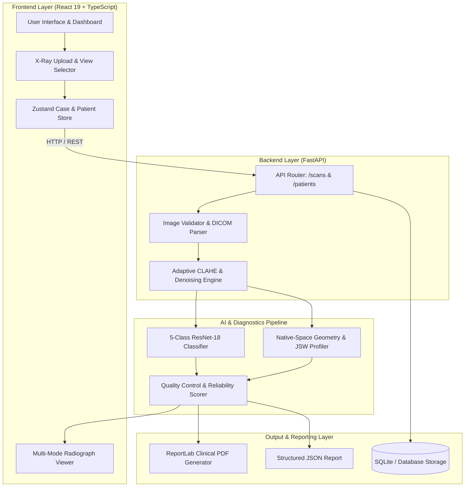
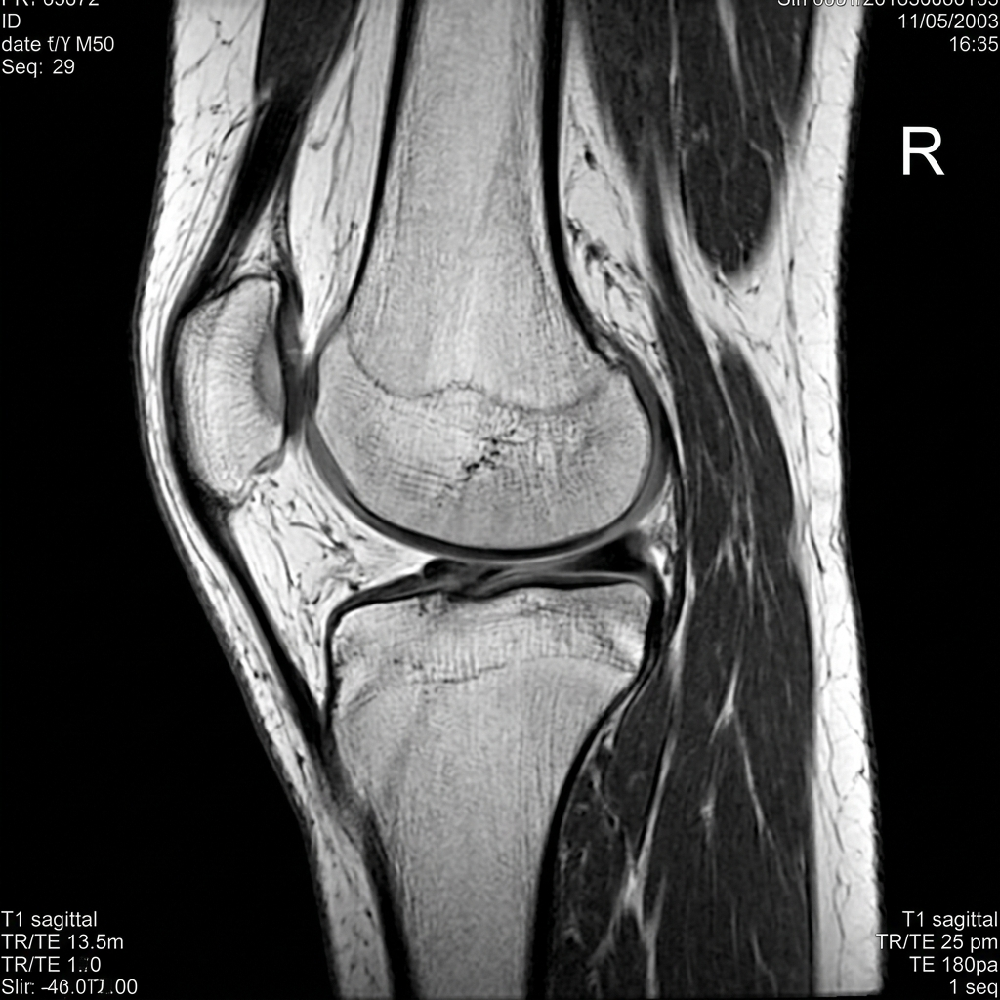
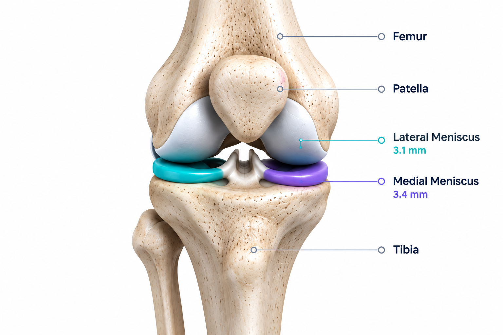
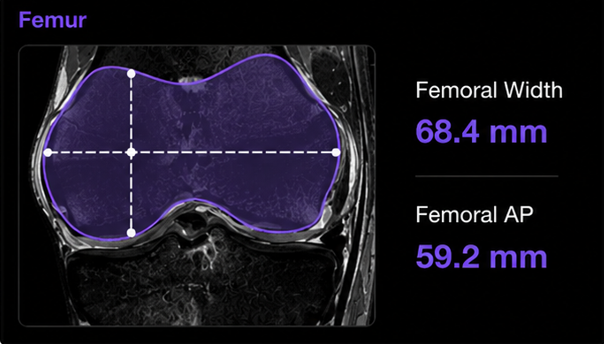
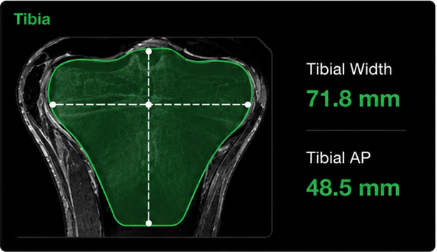
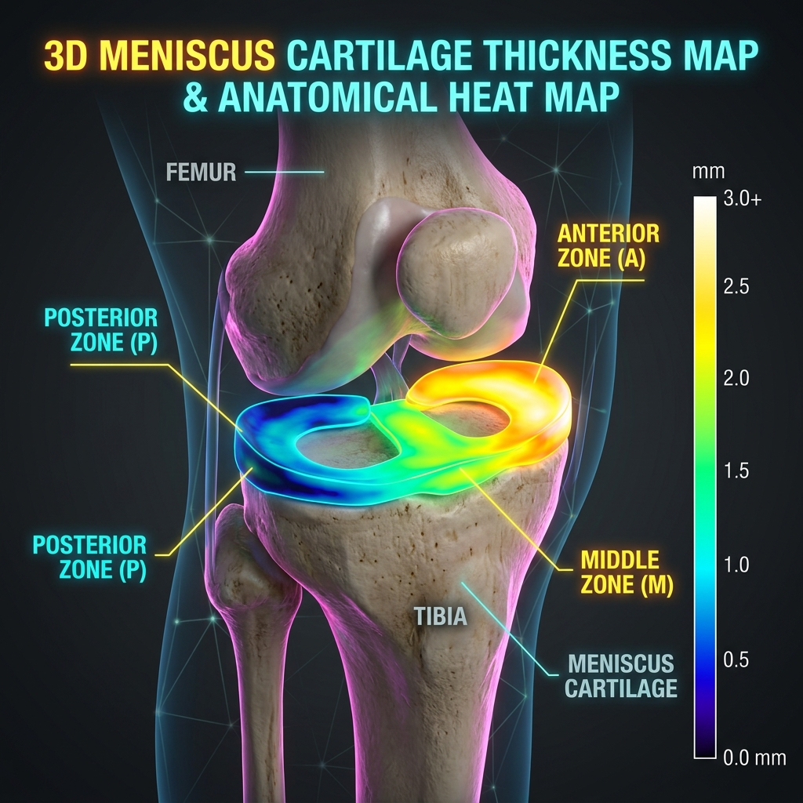
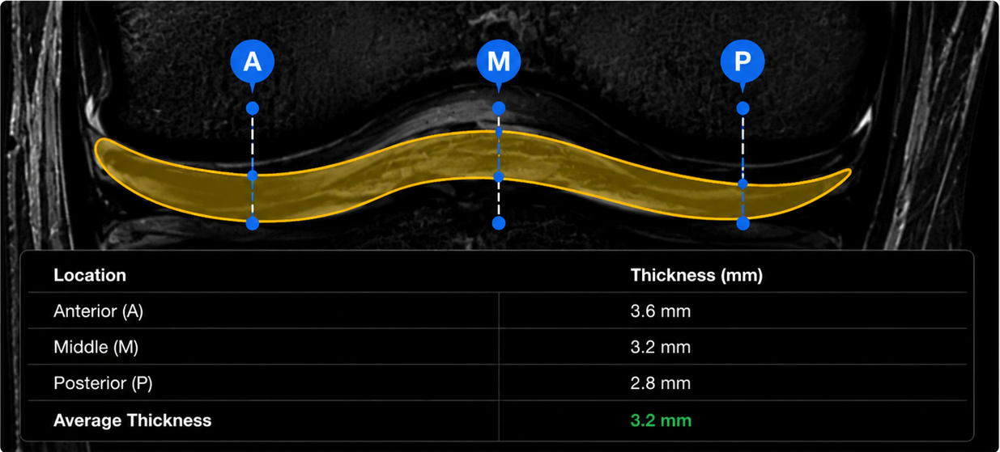

<p align="center">
  
</p>

<h1 align="center">ORTHINX</h1>

<p align="center">
  <strong>AI-Powered Knee X-Ray Analysis & Severity Classification Platform</strong>
</p>

<p align="center">
  <a href="#-features"></a>
  <a href="#-technology-stack"></a>
  <a href="#-technology-stack"></a>
  <a href="#-technology-stack"></a>
  <a href="#-technology-stack"></a>
  <a href="#-technology-stack"></a>
  <a href="#-license"></a>
</p>

---

## 📖 Overview

**ORTHINX** is an end-to-end medical imaging platform engineered for automated 5-class Osteoarthritis severity classification, radiograph enhancement, anatomical morphometry, and multi-section clinical PDF report generation from 2D knee radiographs. 

Built with **PyTorch**, **FastAPI**, and **React 19**, ORTHINX bridges the gap between machine learning research and clinical workflow by providing transparent model confidence scores, probability distributions, pixel-to-millimeter calibration, and structured diagnostic summaries.

---

## ✨ Features

### 🩻 X-Ray Analysis & Preprocessing
* **Multi-Format Ingestion:** Robust validation and ingestion of standard 2D formats (PNG, JPG, TIFF, BMP) and DICOM (`.dcm`) with spatial metadata extraction.
* **Adaptive Enhancement:** Safe contrast normalization using CLAHE (Contrast Limited Adaptive Histogram Equalization) and edge-preserving bilateral denoising without hallucinating anatomical features.
* **Multi-View Support:** Dedicated projections for Anterior-Posterior (AP Front), Lateral (Side), and Axial (Top) knee radiographs.
* **Letterbox Scaling:** Aspect-ratio-preserving uniform scaling and padding (224×224 / 512×512) for zero-distortion neural inference.

### 🧠 AI Severity Classification
* **5-Grade Assessment:** Automated Osteoarthritis severity grading across 5 classes: **Normal (0)**, **Doubtful (1)**, **Mild (2)**, **Moderate (3)**, and **Severe (4)**.
* **Confidence & Probability Distribution:** Exposes full 5-class softmax probability vectors alongside the primary predicted grade.
* **Model Versioning:** Complete metadata tracking of model architecture, weights checkpoint, and training configuration.

### 📏 Anatomical Measurements & Morphometry
* **Joint Space Width (JSW) Profiling:** Calculates medial, lateral, minimum, and mean joint space width clearance.
* **Bone Dimensions:** Delineates femoral condylar width and tibial plateau width.
* **Strict Calibration Safety:** Computes physical measurements in millimeters (`mm`) only when verified pixel spacing is provided; otherwise strictly reports native sensor pixel coordinates (`px`).

### 🦿 Segmentation & Graceful Degradation
* **Integrity by Design:** No synthetic masks, fabricated dice scores, or hallucinated boundaries are ever generated.
* **Graceful Degradation:** When dedicated trained segmentation weights are unavailable, the interface explicitly displays:
  > *"Segmentation unavailable — no trained segmentation model is currently available"* and *"Measurement unavailable — valid segmentation result required"*, while keeping the primary 5-class severity classification fully active.

### 📄 Clinical PDF & JSON Reporting
* **Medical-Grade PDF Generation:** Compiles structured clinical reports via ReportLab with dual-image visualizers, 5-class probability tables, quality scores, patient metadata, and electronic physician signature blocks.
* **Structured JSON Export:** Downloadable machine-readable JSON summaries for PACS and EHR integration.

### 👤 Patient & Case Management
* **Case Isolation:** Case data isolation ensuring zero state bleeding between different patient studies.
* **Archive & Study History:** Real-time study indexing, case review, and direct re-analysis navigation.

---

## 🏗️ System Architecture



---

## 🔄 How ORTHINX Works

1. **Select or Register Patient:** Create a new patient profile or select an existing case from the directory.
2. **Upload Knee Radiograph:** Select standard 2D radiograph or DICOM file and specify the anatomical view (AP, Lateral, Axial).
3. **Validate & Preprocess:** The system verifies file integrity, normalizes bit depth, and applies adaptive contrast enhancement.
4. **Run AI Severity Classification:** The deep CNN analyzes the radiograph and outputs the predicted severity grade with full class probabilities.
5. **Quality Control & Verification:** Telemetry algorithms assess the reliability score, pixel calibration, and artifact integrity.
6. **Review Diagnostics:** Inspect the interactive radiograph viewport with mode toggling between original, enhanced, and overlay views.
7. **Export Clinical Report:** Generate and download a publication-grade clinical PDF or structured JSON report.

---

## 🧠 AI Model Architecture

| Parameter | Specification |
| :--- | :--- |
| **Model Type** | 5-Class Deep Convolutional Neural Network (Transfer Learning) |
| **Backbone Architecture** | **ResNet-18** (ImageNet Pretrained Initialization) |
| **Classification Head** | `nn.Sequential(nn.Dropout(0.3), nn.Linear(512, 5))` |
| **Input Shape** | `(1, 3, 224, 224)` (RGB, ImageNet normalized) |
| **Loss Function** | Class-Weighted Cross-Entropy Loss |
| **Optimizer** | AdamW ($\text{lr} = 10^{-4}$, $\text{weight\_decay} = 10^{-3}$) |
| **Learning Rate Schedule** | Cosine Annealing Schedule |
| **Target Classes** | Normal (0), Doubtful (1), Mild (2), Moderate (3), Severe (4) |
| **Primary Checkpoint** | `model_weights/knee_severity_best.pth` |

---

## 📊 Dataset

The 5-class severity classifier is trained and validated on a 3,300-image dataset containing expert annotations across two annotator sets (`MedicalExpert-I` and `MedicalExpert-II`):

| Class Identifier | Severity Grade | Clinical Interpretation |
| :--- | :---: | :--- |
| **`0Normal`** | Grade 0 | No radiographic features of osteoarthritis |
| **`1Doubtful`** | Grade 1 | Minute osteophytes of doubtful clinical significance |
| **`2Mild`** | Grade 2 | Definite osteophytes with unimpaired joint space |
| **`3Moderate`** | Grade 3 | Moderate joint space reduction with osteophyte formation |
| **`4Severe`** | Grade 4 | Severe joint space narrowing with subchondral sclerosis |

### Leak-Free Split Breakdown
To prevent data leakage from identical radiographs across annotators, dataset splitting groups images by **SHA256 content hash** (1,633 unique clusters):

* **Train Set (70%):** 2,310 images
* **Validation Set (15%):** 498 images
* **Test Set (15%):** 492 images
* **Split Assertions:** $\text{Train} \cap \text{Val} = \emptyset$, $\text{Train} \cap \text{Test} = \emptyset$, $\text{Val} \cap \text{Test} = \emptyset$

> **Dataset Distinction:** This dataset contains raw classified radiographs for 5-class severity grading. It does not contain ground-truth pixel segmentation masks.

---

## 🧪 Results & Evaluation

The trained model was evaluated on the **untouched test split of 492 images**:

| Metric | Verified Score |
| :--- | :---: |
| **Overall Accuracy** | **67.68%** |
| **Balanced Accuracy** | **64.88%** |
| **Macro Precision** | **67.09%** |
| **Macro Recall** | **64.88%** |
| **Macro F1-Score** | **0.6552** |
| **Weighted F1-Score** | **0.6744** |

### Per-Class Test Breakdown

| Class | Support ($N$) | Precision | Recall | F1-Score |
| :--- | :---: | :---: | :---: | :---: |
| **Normal** (Grade 0) | 153 | **83.1%** | **73.9%** | **0.782** |
| **Doubtful** (Grade 1) | 143 | 57.6% | 74.1% | 0.648 |
| **Mild** (Grade 2) | 68 | 44.0% | 32.4% | 0.373 |
| **Moderate** (Grade 3) | 66 | **73.3%** | 66.7% | **0.698** |
| **Severe** (Grade 4) | 62 | **77.4%** | **77.4%** | **0.774** |

<p align="center">
  
</p>

---

## 🖥️ Application Screens & Visual Artifacts

### 1. Diagnostic Imaging & Visualizer
<p align="center">
  
  &nbsp;&nbsp;
  
</p>

### 2. Morphometric Measurement Visualizations
<p align="center">
  
  &nbsp;&nbsp;
  
</p>

### 3. Joint Articulation & Meniscus Mapping
<p align="center">
  
  &nbsp;&nbsp;
  
</p>

---

## 🛠️ Technology Stack

| Layer | Technology | Description |
| :--- | :--- | :--- |
| **Frontend Framework** | **React 19** | Modern reactive component architecture |
| **Type Safety** | **TypeScript 5.x** | Strict interface modeling and type checking |
| **Build Tool** | **Vite 8.x** | High-performance bundling and HMR dev server |
| **State Management** | **Zustand 5.x** | Client-side reactive state and case isolation |
| **Styling & Icons** | **CSS3 & Lucide** | Modern medical UI design system & iconography |
| **Backend API** | **FastAPI** | High-throughput asynchronous Python REST API |
| **ASGI Server** | **Uvicorn** | Fast ASGI production server |
| **AI / Deep Learning** | **PyTorch & torchvision** | Neural network modeling, training & inference |
| **Medical Framework** | **MONAI** | Medical Open Network for AI architectures |
| **Image Processing** | **Pillow & OpenCV** | Adaptive CLAHE, denoising, array manipulations |
| **Metrics & Data** | **Scikit-Learn & Pandas** | Stratified split generation & statistical metrics |
| **PDF Reporting** | **ReportLab 5.x** | Clinical document layout engine with NumberedCanvas |
| **Database** | **SQLite & SQLAlchemy** | Case archival and patient record persistence |

---

## 📁 Project Structure

```text
ORTHINX/
├── src/                               # Frontend Application
│   ├── assets/                        # Logos, icons, and diagnostic assets
│   ├── components/                    # UI cards, layouts, and navigation bars
│   │   ├── common/                    # ActiveCaseGuard, ErrorBoundary
│   │   ├── layout/                    # MainLayout, Sidebar, TopBar
│   │   └── ui/                        # AnimatedButton, TelemetryBadges
│   ├── lib/                           # API client (fetch wrapper & endpoints)
│   ├── pages/                         # Application routes
│   │   ├── AnalysisResultsPage.tsx    # AI severity card & 5-class distribution
│   │   ├── AnatomicalMeasurementsPage.tsx
│   │   ├── DashboardPage.tsx          # Analytics overview & quick stats
│   │   ├── MeniscusAnalysisPage.tsx   # Meniscus clearance profile
│   │   ├── PatientDetailPage.tsx      # Patient history & case registry
│   │   ├── PatientRecordsPage.tsx     # Patient directory
│   │   ├── ReportsPage.tsx            # PDF preview and download
│   │   └── UploadImagePage.tsx        # Radiograph uploader & pre-enhancer
│   ├── store/                         # Zustand store (analysisStore, patientStore)
│   ├── App.tsx                        # Root application component
│   ├── index.css                      # Core design system & theme variables
│   ├── main.tsx                       # React DOM root entrypoint
│   └── router.tsx                     # React Router configuration
│
├── knee ai analyzer/                  # Backend Application
│   └── knee ai analyzer/
│       ├── app/
│       │   ├── api/                   # FastAPI routes (scans.py, patients.py)
│       │   ├── core/                  # Configuration & settings
│       │   ├── db/                    # SQLAlchemy database engine
│       │   ├── models/                # ORM models (Patient, Scan)
│       │   ├── schemas/               # Pydantic schemas
│       │   ├── services/              # Business logic & AI pipelines
│       │   │   ├── classification/    # 5-Class PyTorch inference service
│       │   │   ├── measurements/      # JSW & geometric morphometry
│       │   │   ├── preprocessing/     # CLAHE, denoising, DICOM loader
│       │   │   ├── reporting/         # ReportLab clinical PDF engine
│       │   │   ├── segmentation/      # MONAI U-Net models
│       │   │   └── single_image/      # End-to-end single-image pipeline
│       │   └── main.py                # FastAPI entrypoint
│       ├── data/
│       │   ├── metadata/              # Dataset split CSVs (train, val, test)
│       │   └── validation_results/    # Test results JSON, CSV & confusion matrix
│       ├── model_weights/             # Model checkpoints (.pth) & configs (.json)
│       ├── scratch/                   # Reproducible dataset splitting script
│       └── .env.example               # Environment variables template
│
├── package.json                       # Node dependencies and scripts
├── vite.config.ts                     # Vite configuration and proxy setup
├── tsconfig.json                      # TypeScript configuration
├── README.md                          # Project documentation
└── .gitignore                         # Git exclusion rules
```

---

## 🚀 Installation & Setup

### Prerequisites
* **Node.js**: `v18+` or `v20+`
* **Python**: `3.10` or `3.11`
* **Git**

### 1. Clone the Repository
```bash
git clone https://github.com/heman-svg/ORTHINX-Knee-AI-Analyzer.git
cd ORTHINX-Knee-AI-Analyzer
```

### 2. Backend Setup
```bash
# Navigate to the backend directory
cd "knee ai analyzer/knee ai analyzer"

# Create and activate a Python virtual environment
python -m venv venv

# Windows (PowerShell):
.\venv\Scripts\Activate.ps1
# Linux / macOS:
# source venv/bin/activate

# Install backend dependencies
pip install -r requirements.txt

# Create local environment configuration
cp .env.example .env
```

### 3. Frontend Setup
```bash
# Return to root directory
cd ../../

# Install frontend dependencies
npm install
```

---

## ▶️ Running ORTHINX

### Step 1: Start the FastAPI Backend
```bash
# In the backend directory with venv activated:
python -m uvicorn app.main:app --host 127.0.0.1 --port 8000 --reload
```
* **Backend Status:** `http://127.0.0.1:8000/`
* **Interactive API Docs:** `http://127.0.0.1:8000/docs`

### Step 2: Start the Frontend Application
```bash
# In the root ORTHINX directory:
npm run dev
```
* **Frontend Web Application:** `http://localhost:5173`

---

## 📡 Key API Endpoints

| Method | Endpoint | Description |
| :---: | :--- | :--- |
| `POST` | `/scans/analyze-single` | Upload and analyze a knee radiograph (5-class classification + telemetry) |
| `POST` | `/scans/enhance-preview` | Generate instant CLAHE-enhanced image preview |
| `GET` | `/scans/case/{case_id}` | Retrieve analyzed case details and classification JSON |
| `GET` | `/scans/case/{case_id}/pdf` | Generate and stream formal ReportLab clinical PDF report |
| `GET` | `/scans/cases/all` | List all historical case summaries |
| `DELETE`| `/scans/cases/all` | Clear case history and temporary analysis artifacts |
| `GET` | `/patients` | List registered patient records |
| `POST` | `/patients` | Register a new patient record |
| `GET` | `/health` | Backend service health and device status check |

---

## ⚠️ Limitations & Technical Boundaries

* **Research Prototype:** ORTHINX is developed as a research and decision-support tool. It is not an FDA/CE-cleared diagnostic device.
* **Non-Clinical Diagnosis:** AI classification predictions indicate probabilistic patterns and must be corroborated by qualified orthopedic specialists.
* **Calibration Contingency:** Physical measurements in millimeters (`mm`) require verified pixel spacing calibration (DICOM tag `(0028,0030)` or user-entered spacing). Without calibration, measurements are provided strictly in pixels (`px`).
* **Segmentation Status:** Because the primary replacement dataset contains classification labels without ground truth pixel masks, segmentation output gracefully indicates unavailability rather than synthesizing artificial boundaries.

---

## 🔐 Privacy & Medical Data Handling

* **Local Inference:** All AI inference, image processing, and PDF generation execute locally on the host server.
* **No Cloud Phoning:** Images and patient metadata are not transmitted to third-party APIs.
* **Responsible Deployment:** When hosting in production or staging environments, ensure TLS/HTTPS encryption, authentication guards, and compliance with institutional data governance policies.

---

## 🗺️ Roadmap

- [x] Multi-format radiograph ingestion (PNG, JPG, TIFF, DICOM)
- [x] Aspect-ratio-preserving letterbox preprocessing
- [x] Adaptive CLAHE contrast normalization & bilateral filter
- [x] 5-Class PyTorch severity classifier (Normal, Doubtful, Mild, Moderate, Severe)
- [x] Leak-free hash-stratified train/val/test splits (3,300 images)
- [x] ReportLab multi-section clinical PDF generation
- [x] React 19 + TypeScript frontend with reactive case store
- [ ] Multi-center external cohort validation
- [ ] Automated anatomical keypoint landmarking
- [ ] Integration of validated full-joint segmentation models

---

## 🤝 Contributing

Contributions, feedback, and issue reports are welcome.

1. Fork the Project repository.
2. Create your Feature Branch (`git checkout -b feature/AmazingFeature`).
3. Commit your Changes (`git commit -m 'Add some AmazingFeature'`).
4. Push to the Branch (`git push origin feature/AmazingFeature`).
5. Open a Pull Request.

---

## 📜 License

This project is licensed under the **ISC License**. See the `package.json` file for details.

---

## ⚕️ Clinical Disclaimer

> **IMPORTANT NOTICE:** ORTHINX is intended solely for research, educational, and clinical decision-support purposes. It is not a clinically certified medical device and must not be used as the primary basis for clinical diagnosis, treatment planning, or surgical intervention. Final diagnostic and therapeutic decisions remain the sole responsibility of licensed medical professionals.

---

## 👨‍💻 Project & Repository

* **Project:** ORTHINX — AI-Powered Knee X-Ray Analysis Platform
* **Focus:** Deep Learning, Musculoskeletal Imaging, Clinical Decision Support
* **GitHub Repository:** [https://github.com/heman-svg/ORTHINX-Knee-AI-Analyzer](https://github.com/heman-svg/ORTHINX-Knee-AI-Analyzer)
